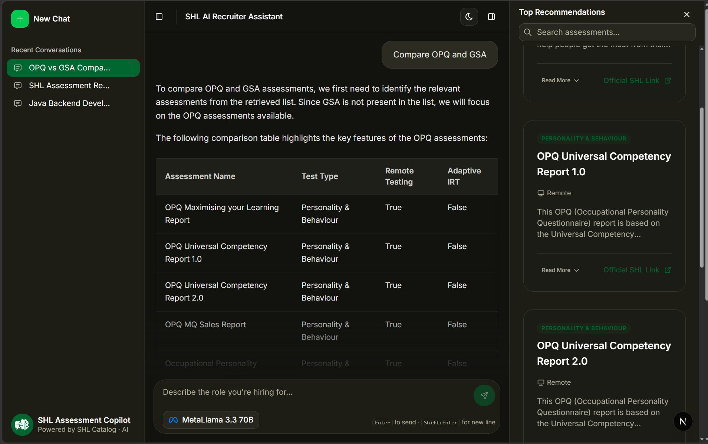

# SHL Assessment Recommender

<div align="center">
  
  
  <br />
  <br />

  [](https://shl-tech-test.vercel.app/)

  <br />

  > A conversational AI agent that takes hiring managers from a vague role description to a grounded shortlist of SHL assessments — through natural dialogue.

</div>

---

## Overview

Most assessment catalogues require keyword search and faceted filtering, which assumes the user already knows the right vocabulary. **SHL Assessment Recommender** solves this by letting you describe what you need in plain language — and the agent does the rest.

Built as a take-home assignment for the **SHL Labs AI Intern Role**.

---

## Features

- **Clarify** — asks focused follow-up questions when the query is too vague
- **Recommend** — returns 1–10 grounded assessments with names and catalog URLs
- **Refine** — updates the shortlist mid-conversation without restarting
- **Compare** — compares two or more assessments using catalog data only
- **Scope guardrails** — refuses off-topic questions, general hiring advice, and prompt injection attempts
- **Real-time status** — live SSE stream shows thinking → retrieving → reading → generating
- **Fuzzy search** — search across recommendations by name, category, or description
- **Conversation memory** — summarized context carried across turns
- **Model switcher** — swap between Groq models on the fly

---

## Tech Stack

| Layer | Technology |
|---|---|
| Frontend | Next.js 14, shadcn/ui, Tailwind CSS, Zustand |
| Backend | Node.js, Express, TypeScript |
| AI / LLM | Groq API (LLaMA 3.3 70B) |
| Vector Search | Qdrant |
| Database | MongoDB |
| Streaming | Server-Sent Events (SSE) |
| Icons | Tabler Icons |

---

## How It Works

```
User message
     │
     ▼
Intent Classifier (Groq, fast call)
     │
     ├── clarify     → ask one focused question
     ├── recommend   → vector search → LLM → structured shortlist
     ├── compare     → vector search → LLM → comparison table
     ├── refine      → apply constraint delta → updated shortlist
     └── off_topic   → politely refuse
```

1. Every `POST /chat` call carries the full conversation history — the API is stateless.
2. Intent is classified first with a cheap small call before the main LLM runs.
3. Qdrant performs semantic vector search over the scraped SHL catalog.
4. The LLM is grounded strictly on retrieved catalog data — no hallucinated URLs or assessment names.
5. Recommendations are sent as structured JSON separately from the conversational reply.

---

## API

### `GET /health`
```json
{ "status": "ok" }
```

### `POST /chat`

**Request**
```json
{
  "messages": [
    { "role": "user", "content": "Hiring a mid-level Java developer who works with stakeholders" },
    { "role": "assistant", "content": "What seniority level are you targeting?" },
    { "role": "user", "content": "Around 4 years of experience" }
  ]
}
```

**Response (SSE stream)**
```
data: {"type":"status","status":"thinking","detail":"Understanding your request…"}
data: {"type":"status","status":"retrieving","detail":"Searching SHL assessment catalog…"}
data: {"type":"retrieved_count","count":6,"detail":"Found 6 relevant assessments"}
data: {"type":"status","status":"reading","detail":"Reading 6 assessment profiles…"}
data: {"type":"status","status":"generating","detail":"Composing response…"}
data: {"type":"text","content":"Got it. Here are assessments that fit..."}
data: {"type":"recommendations","content":[{"name":"Java 8 (New)","url":"https://www.shl.com/...","test_type":"K"}]}
data: {"type":"conversationId","content":"..."}
data: {"type":"end_of_conversation","value":false}
data: [DONE]
```

---

## Getting Started

### Prerequisites
- Node.js 18+
- MongoDB
- Qdrant instance
- Groq API key

### Installation

```bash
# Clone the repo
git clone https://github.com/yourusername/shl-assessment-recommender.git
cd shl-assessment-recommender

# Install dependencies
cd client && npm install
cd ../server && npm install

# Set up environment variables
cp .env.example .env
```

### Environment Variables

**Server `.env`**
```env
PORT=8000
MONGODB_URI=your_mongodb_uri
GROQ_API_KEY=your_groq_api_key
QDRANT_URL=your_qdrant_url
QDRANT_COLLECTION=shl_assessments
```

**Client `.env.local`**
```env
NEXT_PUBLIC_API_URL=http://localhost:8000
```

### Run

```bash
# Start backend
cd server && npm run dev

# Start frontend
cd client && npm run dev
```

Open [http://localhost:3000](http://localhost:3000)

---

## Evaluation Criteria Met

| Criteria | Status |
|---|---|
| Schema compliance on every response | ✅ |
| Items from catalog only in recommendations | ✅ |
| Turn cap (max 8) honored | ✅ |
| Agent clarifies before recommending on vague queries | ✅ |
| Agent refuses off-topic and prompt injection | ✅ |
| Agent honors mid-conversation refinements | ✅ |
| No hallucinated assessments or URLs | ✅ |

---

## Suggested Test Queries

| Persona | Query |
|---|---|
| The Rushed Recruiter | `Hiring a senior software engineer, need assessments ASAP` |
| The JD Paster | `We need a data analyst, strong in Excel and SQL, presents to leadership weekly` |
| The Personality Seeker | `Looking for a customer support lead — I care more about attitude than technical skills` |
| The Comparer | `What's the difference between OPQ32 and MQ? Which fits a sales role better?` |
| The Refiner | `Remove cognitive tests from what you recommended, only keep personality ones` |
| The Volume Hirer | `Hiring 200 graduate trainees across finance, ops, and tech — one assessment for all` |

---

## License

MIT © 2026 Abhijeet Singh
